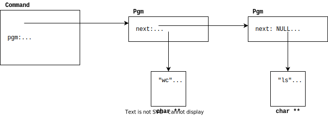

# Introduction

In this lab, you'll build your own shell.
A shell interprets and executes user commands.
For instance, typing `ls` will launch a child process to run the `ls` program, while the parent shell waits for it to finish.
Beyond basic commands, you'll explore features like input/output redirection and command piping.

# Specifications

To pass the lab, your shell, `lsh`, needs to:

1. **Ctrl-D Handling**: Respond to Ctrl-D (EOF) to exit.

2. **Basic Commands**: Execute simple commands like `ls`, `date`, and `who`. It should also recognize the `PATH` environment variable to locate commands.

3. **Background Execution**: Allow running commands in the background, e.g., `sleep 30 &`.

4. **Piping**: Support one or more pipes between commands, e.g., `ls | grep out | wc -w`.

5. **I/O Redirection**: Enable standard input and output redirection to files, e.g., `wc -l < /etc/passwd > accounts`.

6. **Built-ins**: Provide `cd` and `exit` as built-in functions.

7. **Ctrl-C Handling**: Ctrl-C should terminate the current foreground process but not the shell itself.
                        Ctrl-C should not affect background jobs.

8. **No Zombies**: Your shell should not leave any zombie processes behind.

**Important:** Your shell has to be completely independent, and it is not allowed to delegate the command execution to other available shells.
**It is not allowed to use a system call system() to invoke `sh`, `bash` or any other system shell.**

# The Report

In addition to your implementation, you are required to write a report no less than 1,300 words.
In your report, aim to address the following questions:

- Have you met all the specifications outlined for the lab?
- In which order?
- What challenges did you encounter in meeting each specification?
- Do you have any feedback for improving the lab materials?
  - Did you find the automated tests useful?
  - Do you feel that there is any test case missing?

# Parsing Commands

The skeleton implementation handles the parsing of commands for you.
It uses the GNU readline library, which means that commands can be entered using the same features as in `tcsh`.

Further, a history function is provided, allowing the user to browse through previous commands using Ctrl-P and Ctrl-N.
More specifically, the skeleton `lsh` contains the function:

```c
int parse (char *line, Command *cmd)
```

which parses a command and stores it in the `cmd` variable.
The parse function returns 1 if there are no errors and -1 otherwise.

For example, the following code:
```c
int r;
Command cmd;
r = parse( "ls -l | wc > apa", &cmd);
```

returns `r` equal to 1.

After the call, `cmd` will have the following structure:


Note that commands are processed last-to-first (for a good reason!).
You can take a look at the `DebugPrintCommand` function in `lsh.c` for an example of how to handle the `Command` structure.

# System Calls

To be able to carry out the lab successfully, you will have to study the manual pages for various system calls like
`fork(), exec(), wait(), stat(), signal(), pipe(), dup()`.

For some of them, e.g. `exec()`, several **variants** exist.
You need to figure out which one suits you better; sometimes, there is more than one that is suitable.

# Using `top` for Debugging

Use `top` to monitor your `lsh` processes.
Open a second terminal and run `top`.
Type `u`, followed by your CID and `[enter]` to filter the processes started by you.
Enable "forest view" by pressing `V`.
Keep an eye on the "S" column to spot zombies!

# Manual testing

Use the following manual tests to ensure your shell meets the specifications.
Compare its behavior with standard shells like `bash` or `zsh`.

## Simple Commands

```sh
date
hello
```

The first command exists and the second one does not.
Observe the system calls that are executed.
If any of the programs fail, what is printed?
Where? What happens to any child processes that your shell has created?

## Commands with parameters

```sh
ls -al -p
```

## Redirection with in and out files

```sh
ls -al > tmp.1
cat < tmp.1 > tmp.2
diff tmp.1 tmp.2
```

Is the output of `diff` what you expected?

## Background Processes

```sh
sleep 60 &
sleep 60 &
sleep 60
```

Try to look at the parent process that is waiting for the child process using `top`,
as described in the debugging section.
Run the list of commands several times and use kill to see after which command it is possible to generate a prompt.

Try pressing Ctrl-C in the `lsh` after the last `sleep`.
Does the foreground process stop?
Do the background processes also stop?
What is the expected behavior? Wait 60 seconds.
Are there any zombie processes left?

## Process Communication (Pipes)

Verify that your shell supports one or more pipes.

```sh
ls -al | wc -w
ls -al | wc
ls | grep lsh | sort -r
```

Does the prompt appear after the output of the above command?

```sh
ls | wc &
```

After running the above, when does the prompt reappear?

```sh
cat < tmp.1 | wc > tmp.3
cat tmp.1 | wc
cat tmp.3
```

Compare the output of the last two commands above.
Are they the same?
Why/why not?

```sh
abf | wc
ls | abf
grep apa | ls
```

What are the outputs?
When does the prompt appear?
Use Ctrl-D, if necessary, to let the grep finish and to let the shell process take over.
Does the `grep` command terminate eventually (use `top` to check).
Why/why not?

## Built-in Commands

```sh
cd ..
cd lab1
cd tmp.tmp
```

Was there an error generated when executing the commands above?

```sh
cd ..
cd lab1 | abf
ls
```

Did the command `ls` work?

```sh
cd
```

Was there an error?
Use `pwd` to see which the current working directory is.

```sh
grep exit < tmp.1
```

Did the shell quit, or did it consider `exit` as a text string to find in a file?

```sh
..exit
```

And here? **(Use spaces instead of dots)**

```sh
grep exit | hej
```

Was there an error here? Does the prompt appear?

```sh
grep cd | wc
```

Did an output appear?
Does it appear after pressing Ctrl-D?

```sh
exit
```

Are there any zombies after exiting `lsh`?

# Appendix: Useful Unix Commands[^1]
## The man Utility

You will need to use the UNIX file API and the UNIX process API for this assignment.
However, there are too many functions for us to enumerate and describe all of them.
Therefore you must become familiar with the man utility, if you aren't already.
Running the command man command will display information about that command (called a "man page"),
and specifically, man `unix_func` will display the man page for the UNIX function `unix_func().`.
So, when you are looking at the UNIX functions needed to implement this assignment, use man to access detailed information about them.
The man program presents you with a simple page of text about the command or function you are interested in, and you can navigate the text using these commands:

1.  Down arrow goes forward one line

2.  Up arrow goes back one line

3.  `f` or Spacebar goes forward a page

4.  `b` goes back a page

5.  `G` goes to the end of the man page

6.  `g` goes to the start of the man page

7.  `q` exits man

One problem with man is that there are often commands and functions with the same name;
the UNIX command `open` and the UNIX file API function `open()` are an example of this.
To resolve situations like this, man collects keywords into groups called "sections";
when man is run, the section to use can also be specified as an argument to man.
For example, all shell commands are in section 1. (You can see this when you run man;
for example, when you run `man ls` you will see the text `LS(1)` at the top of the man page.)
Standard UNIX APIs are usually in section 2, and standard C APIs are usually in section 3.

So, if you run `man open`, you will see the documentation for the open
command from section 1. However, if you run `man 2 open`, you will see
the description of the `open()` API call, along with what header file to
include when you use it, and so forth.

You can often even look at some of the libraries of functions by using the name of the header file.
For example, `man string` (or `man 3 string`) will show you the functions available in `string.h,` and `man stdio` will show you the functions available in `stdio.h.`

## Console I/O Functions

You can use `printf()` and `scanf()` (declared in `stdio.h`) for your
input and output, although it is probably better to use `fgets()` to
receive the command from the user. Do not use gets(), ever!!! You should
always use `fgets(stdio, ...)` instead of `gets()` since it will allow
you to specify the buffer length. Using `gets()` virtually guarantees
that your program will contain buffer overflow exploits.

## String Manipulation Functions

The C standard API includes many string manipulation functions for you
to use in parsing commands. These functions are declared in the header
file string.h. You can either use these functions, or you can analyze
and process command strings directly.

`strchr()` Looks for a character in a string.

`strcmp()` Compares one string to another string.

`strcpy()` Copies a string into an existing buffer; does not perform
allocation. Consider using strlcpy()() for safety.

`strdup()` Makes a copy of a string into a newly heap-allocated chunk of
memory, which must later be `free()`d.

`strlen()` Returns the length of a string.

`strstr()` Looks for a substring in another string.

## Process Management Functions

The `unistd.h` header file includes standard process management
functions like forking a process and waiting for a process to terminate.

`getlogin()` Reports the username of the user that owns the process.
This is useful for the command prompt.

`getcwd()` Reports the current working directory of a process. This is
also useful for the command prompt.

`chdir()` Changes the current working directory of the process that
calls it.

`fork()` Forks the calling process into a parent and a child process.

`wait()` Waits for a child process to terminate, and returns the status
of the terminated process. Note that a process can only wait for its own
children; it cannot wait e.g. for grandchildren or for other processes.
This constrains how command-shells must start child processes for piped
commands.

`execve()`, `execvp()` The `execve()` function loads and runs a new
program into the current process. However, this function doesn't search
the path for the program, so you always have to specify the absolute
path to the program to be run.

However, there are a number of wrappers to the `execve()` function. One
of these is `execlp(),` and it examines the path to find the program to
run, if the command doesn't include an absolute path. Be careful to read
the man page on `execvp()` so that you satisfy all requirements of the
argument array. (Note that once you have prepared your argument array,
your call will be something like `execvp(argv[0],` argv).)

## Filesystem and Pipe Functions

`open()` Opens a file, possibly creating and/or truncating it when it is
opened, depending on the mode argument. If you use `open()` to create a
file, you can specify 0 for the file-creation flags.

`creat()` Creates a file (although why not use open() instead?).

`close()` Closes a file descriptor.

`dup()`, `dup2()` These functions allow a file descriptor to be
duplicated. `dup2()` will be the useful function to you, since it allows
you to specify the number of the new file descriptor to duplicate into.
It is useful for both piping and redirection.

`pipe()` Creates a pipe, and then returns the two file descriptors that
can be used to interact with the pipe. This function can be used to pipe
the output of one process into the input of another process:

1.  The parent process creates a new pipe using `pipe()`.

2.  The parent process `fork()s` off the child process. Of course, this
    means that the parent and the child each have their own pair of
    read/write file-descriptors to the same pipe object.

3.  The parent process closes the read-end of the pipe (since it will be
    outputting to the pipe), and the child process closes the write-end
    of the pipe (since it will be reading from the pipe).

4.  The parent process uses `dup2()` to set the write-end of the pipe to
    be its standard output, and then closes the original write-end (to
    avoid leaking file descriptors).

5.  Similarly, the child process uses `dup2()` to set the read-end of
    the pipe to be its standard input, and then closes the original
    read-end (to avoid leaking file descriptors)

[^1]: Source: <http://courses.cms.caltech.edu/cs124/pintos_2.html#SEC27>
