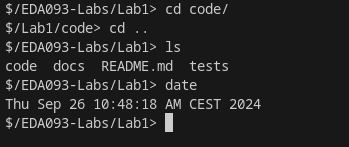

# Lab 1: The zsh shell
Lab group: 9 

Members: Axel Carlsson, William Eriksson Kling, Zaid Haj Ibrahim

## Meeting the specifications
- **Ctrl-D:** EOF is handled by checking if the readline function is empty / NULL when EOF signal is received.
- **Basic commands:** are launched using one of the ```exec``` family functions:
```C
execvp(pgm->pgmlist[0], pgm->pgmlist);
```
- **Background vs Foreground:** To differentiate background and foreground tasks the shell will simply not wait for background tasks. To prevent background tasks from being canceled by Ctrl-C they simply ignore the ```SIGINT``` signal, while the foreground processes use the default handler which terminates their execution.
- **Piping:** is done by forking the shell once for each command in the pipe. For each process the ```STDOUT_FILENO / STDIN_FILENO``` is redirected to the corresponding pipe.
- **IO redirection:** can be done for the first and last command in the pipe,  i.e. the first command can read from a file and the last command can output to a file. In the case of singular command, it can both read from file and output to file since it is both first and last.
- **Builtins:** For cd and exit, two helper functions were created to check if ```cd``` or ```exit``` is received from the user. If the first and only command is either of these they are handled accordingly. Exit command terminates running child processes through ```killpg(0, SIGHUP)``` which will make child processes to exit gracefully, and then exits the shell. If command includes ```cd``` -> execute builtin command ```chdir``` to change directory. Sample shell shown below:



- **Ctrl-C:** To get the expected Ctrl-C behavior, a special ```SIGINT``` handler is registered for the shell process, which doesn't really do anything. As explained above, background processes ignore Ctrl-C and foreground processes use the default handler which stops the process.

- **No zombies:** To prevent zombie process the shell process has a ```SIGCHLD``` handler, which every time the state of a child process changes it will wait for all finished child processes.

- **No external shell:** Our lsh implementation does **NOT** use any external shell or ```system()``` call.


## Specifications discussion 
The implementation of this code does indeed pass all the requirements stated in the specification part of the README file for lab 1 as shown above. This section outlines the requirements that were met in the implemented lsh-shell. The lsh shell can successfully respond to the Ctrl-D command by interpreting the parsed line-input as a null char object and exit the shell terminal and printing “detected EOF” End-Of-File. The lsh shell is capable of handling several simple commands that are executable in a normal bash terminal such as ```ls, date, who``` . The current directory is fetched with ```getcwd()``` and saved in a variable, additionally part of this path, the last two directories, is shown in the lsh shell as shown in above figure. The shell also supports running operations in the background, meaning that a different process handles the operation without disturbing or blocking the shell from executing additional commands. Furthermore, the shell implement piping function which was the most difficult one to implement. For instance, the command “ls | grep out | wc -w “consists of three commands in total and should be executed dependently of each other, meaning that the first command directs its output to the second command and so on. The shell can also read from or write to an external file, known as I/O Redirection. This is done by dealing with symbol “<” or “>”. Moreover, the shell can change the directory using the “cd” command and “exit”. Finally, the Ctrl-C command is implemented so that it only terminates the current foreground processes and not the shell itself, meaning that it shouldn’t affect any background jobs. All these commands and executions are handled in a way that it doesn’t leave zombies behind, meaning that a child is never left by its parent. The implemented lsh-shell doesn’t invoke any system calls from the outer terminal such as bash or sh. 

## In which order?
We implemented the specifications in the order outlined below:

- The first functionalities of the shell to be implemented were Ctrl-D handling, basic commands (which were later extended to handle I/O, piping etc.) and implementing cd and exit. 
To check for Ctrl-D from the user, check for EOF signal and simply end process using SIGHUP signal. 
- For **BUILTINS**: cd and exit, two helper functions were created to check if "cd ..." or "exit" is received from the user. When receiving input from the user, and it is not EOF, check for exit command (exit also terminates running child processes). If there is none, then check if command includes cd (execute command and change directory). If the command is neither, continue process to handle the user input.
- **Execution of simple commands:** Before the process handles basic commands, it forks and makes the new child execute the command. The new process checks if the command is either read or write for a file (check for rstdout and rstdin) and if it is the process that should read or write or both. If so, the process handles these using ```open(), dup2(), STDOUT_FILENO/STDIN_FILENO``` .
- At the same time as the previous step background execution was implemented. Background processes were first implemented by all child processes ignoring ```SIGINT``` and the shell process actively killing foreground process by their ```pid```. Later this was simplified and done as outlined .
- **SIGCHLD:** SIGCHLD was used to collect finished child processes, the shell will wait for the finished processes to collect it using ```waitpid(0, -, WNOHANG)```. This WNOHANG (without suspending the program).
- **Ctrl-C:** We then implemented ```SIGINT``` first in the complicated way as outlined in the point directly above then in conjunction with the point below we did the more elegant solution. 
- **Implement piping:** First, a function called forkAndPipe() was called when the child starts to handle the given command. It takes in both the struct for the command and the number of forks that should be created (number of processes needed). This is calculated by traversing and calculating the length of the pgm linked list from the command struct and subract one (had already forked once from shell process). If the process does not need to fork (either only one command or base case), simply execute the given command. If the process needs to fork, it will do so recursively while both execute a command given to a child and forward the result using. Forwarding is done by closing either the read or write end of its pipe and redirecting STD(OUT/IN)_FILENO using dup2(). This approach was however limited as outlined in . Therefore we started doing the forking only from the shell process in a while loop. For more details see the code and 


## Challenges
An issue with our first implementation, which passed all automatic tests, was that our shell only waits for the last child process in the pipe. Since the processes were created in a cascading fashion and we start our commands with ```execvp```, there is no resonable way of making the child processes wait for its children. This means that if the last command finishes the shell prompt which will reappear but another process might still be using ```stdout```, leading to weird behavior in this case until Ctrl-C is pressed. For example, ```grep apa | ls``` would appear to finish, the prompt reappeared but new commands would display strange behavior if the shell even displayed the text you wrote. When you pressed Ctrl-C the normal behavior would resume, but this was generally very unintuitive behavior. To resolve this issue we realized that the way we created the processes, in cascading fashion, made it impossible for the shell process to wait for all grandchild processes. Thus, we decided fork all processes from the shell process. However, forking all processes from the shell process made the setup of the pipes a lot uglier and more difficult. Since all pipes are created in the shell process and one process might need two different pipes, one to read from and one to write to, we need two pipes available instead of one as in our recursive implementation. This did enable us to wait for all foreground child processes and display similar behavior to e.g. ```bash```.

### Biggest problems
- Generally, simply to understand and make use of functions, signals, inputs etc. from different used code libraries. These are what makes this lab possible, but it can sometimes be a bit of trial and error and reading lots of documentation when trying to find a good solution to a problem. 
- We had some issues early on with zombie processes, but they were quite quickly solved with ```SIGCHLD``` handler.
- One of our biggest issues was that the pipe would hang even though everything was setup correctly, the reader started before the writer, thus the first command in the pipe would promptly finish but the second would wait forever. Through extensive debugging we realised this and discovered the issue. Since the pipes were created by the shell process they would stay open even though they were closed in child process. The reading process of the pipe would not receive EOF since some process might still write to the pipe (since it was open in shell process).
- We first made a complicated solution for not canceling background processes on Ctrl-C, but the one we ultimately went for was very simple.

## Feedback
<<<<<<< HEAD
The automatic test used for this lab looks to include tests that cover most of the requirements for having a working shell (in the capacity that is the lab). It was also a nice check to have during development, as you could use it as a sort of checklist or milestone checker that shows you have made progress. As the FAQ for this lab explain, it it also necessary to perform manual tests to catch potential issues not caught by the automatic test. One such test, the "grep apa | ls" from the same FAQ document, is a test that seems quite important. A suggestion is to either create a automatic test for this, or if not possible, highlight its importance in the README for the labs repository. Regarding the manual testing, it is slightly ambiguous whether it is enough to score all the tests in manual or if the code should also be exposed to further testing method such as arbitrary shell commands that may reveal some weaknesses or bugs in the code. Due to limited time to execute this lab, it would be a rather difficult to implement a fully robust terminal. Furthermore, it was a bit laborious task to check if the issues or failures we received was due to mistake in our written code or that we encountered a “bug” in the test file and we therefore need to update the test file to the newest version or report it.
=======
The automatic test used for this lab looks to include tests that cover most of the requirements for having a working shell (in the capacity that is the lab). It was also a nice check to have during development, as you could use it as a sort of checklist or milestone checker that shows you have made progress. As the FAQ for this lab explain, it it also necessary to perform manual tests to catch potential issues not caught by the automatic test. One such test, the "grep apa | ls" from the same FAQ document, is a test that seems quite important. A suggestion is to either create an automatic test for this, or if not possible, highlight its importance in the README for the labs repository.
>>>>>>> 0df6ae668aca92ec7f9d8facf6e5071e0a8be55b

